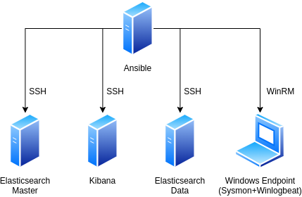

# Introduction

## References

- [Ansible For DevOps](https://www.ansiblefordevops.com/)
- [Ansible Docs](https://docs.ansible.com/)

## Environment



## Create python virtual environment

```sh
python3 -m venv venv-ansible
```

## Activate python virtual environment

```sh
source ./venv-ansible/bin/activate
```

## Upgrade pip

Note: without upgrading pip, installation of cryptography package may fail because of rust dependencies.

```sh
pip install --upgrade pip
```

## Install Ansible, Ansible Lint and Molecule

```sh
pip install ansible ansible-lint 'molecule[docker]'
```

## (Optional) Create SSH key if needed

```sh
ssh-keygen -o -a 100 -t ed25519 -f ~/.ssh/id_ed25519 -C "comments go here"
```

## (Optional) Start ssh-agent

```sh
eval `ssh-agent`
ssh-add
```

## Create inventory

Inventory can have different formats the simplest is the INI format, but you can have it in YAML or a dynamic inventory.

Create file named inventory with following content (replace IP with your VM):

```ini
[elastic]
192.168.40.132
192.168.40.133

[kibana]
192.168.40.134
```

## Ansible ping

```sh
ansible -i inventory -m ping all -u ansible
```

## Set default user in inventory

```ini
[all:vars]
ansible_user = ansible
```

## Set inventory in ansible.cfg

create `ansible.cfg`

```
[defaults]
inventory = inventory
roles_path = ./roles
```

## Adhoc commands

### Command module

```sh
ansible all -m command -a "df -h"
```

or

```sh
ansible all -a "df -h"
```

Module `-m command` is used by default. 

*Note: You can't use pipes or redirection with command module. Use `-m shell` if you need those (not recommended).* 

### Specifying number of forks

```sh
ansible all -a "df -h" -f 20
```

*Default number of forks is 5*

### Background tasks

Run command in background with timeout 3600s and no results polling. 

```sh
ansible elastic -B 3600 -P 0 -a "df -h"
```

Check for result

```sh
ansible elastic -m async_status -a "jid=<JOBID>"
```

# First playbook

## Create playbook.yml

in `playbook.yml` configure variables

```yml
---
- name: Install Elasticsearch
  hosts: elastic
  vars:
    elastic_cluster_name: "our-elasticsearch-cluster"
    elastic_version: 7.17.0
    master_nodes:
      - 192.168.40.132
    elastic_bind:
      - _local_
      - _ens33_
    elastic_log_path: /var/log/elasticsearch
    elastic_data_path: /var/lib/elasticsearch
```

## Add tasks

### Firewall setup

```yml
  tasks:
    - name: UFW allow elasticsearch 9200
      ufw:
        rule: allow
        port: 9200
        proto: tcp
        src: "{{ item }}"
      with_items: "{{ groups['elastic'] + groups['kibana']}}"
      tags:
        - firewall
    - name: UFW allow elasticsearch port 9300
      ufw:
        rule: allow
        port: 9300
        proto: tcp
        src: "{{ item }}"
      with_items: "{{ groups['elastic'] }}"
      tags:
        - firewall
```

### Add Elasticsearch repo

```yml
    - name: Install GPG
      apt:
        name: gpg-agent
        update_cache: true
        state: present
    - name: Add Elasticsearch 7.X repo key
      apt_key:
        id: 46095ACC8548582C1A2699A9D27D666CD88E42B4
        url: "https://artifacts.elastic.co/GPG-KEY-elasticsearch"
        state: present
    - name: Add Elasticsearch 7.X repo
      apt_repository:
        repo: deb https://artifacts.elastic.co/packages/7.x/apt stable main
        filename: elastic-7-repo.list
        state: present
```

### Install Elasticsearch

```yml
    - name: Install Elasticsearch
      apt:
        name: elasticsearch={{ elastic_version }}
        update_cache: true
        state: present
```

### Configure Elasticsearch

#### Create template `templates/elasticsearch.yml.j2`

```jinja
cluster.name: {{ elastic_cluster_name }}
cluster.initial_master_nodes: {{ master_nodes }}
discovery.seed_hosts: {{ master_nodes }}
node.name: {{ elastic_node_name }}
node.roles: {{ elastic_node_roles }}
network.host: {{ elastic_bind }}
path.data: {{ elastic_data_path }}
path.logs: {{ elastic_log_path }}
```

#### Create host_variables for Master node `host_vars/192.168.40.132`

```yml
elastic_node_name: master-node
elastic_node_roles:
 - master
```

#### Create host_variables for Data node `host_vars/192.168.40.133`

```yml
elastic_node_name: data-node
elastic_node_roles:
 - data
```

#### Create template task in `playbook.yml`

```yml
    - name: Configure Elasticsearch
      template:
        src: "elasticsearch.yml.j2"
        dest: "/etc/elasticsearch/elasticsearch.yml"
      notify: restart elasticsearch
```

### Create handler to restart Elasticsearch on config change

```yml
  handlers:
    - name: restart elasticsearch
      systemd:
        name: elasticsearch
        state: restarted
```

### Add become to playbook

```yml
become: true
```

### Enable Elasticsearch service

```yml
    - name: Enable Elasticsearch
      systemd:
        name: elasticsearch
        enabled: true
```

## Debug task

If you ever need to debug anything you can print it using the debug task

```yml
- name: debug groups
  debug:
    msg: "{{ groups['elastic'] + groups['kibana'] }}"
```

# Using Ansible Roles and testing with Molecule

## Initialize new role with Molecule

(in `./roles`)

```sh
molecule init role acme.kibana --driver-name docker
```

## Create tasks

In `tasks/main.yml`

```yaml
---
- name: Add Elasticsearch 7.X repo key
  apt_key:
    id: 46095ACC8548582C1A2699A9D27D666CD88E42B4
    url: "https://artifacts.elastic.co/GPG-KEY-elasticsearch"
    state: present

- name: Add Elasticsearch 7.X repo
  apt_repository:
    repo: deb https://artifacts.elastic.co/packages/7.x/apt stable main
    filename: elastic-7-repo.list
    state: present

- name: Install Kibana
  apt:
    name: kibana={{ kibana_version }}
    update_cache: true
    state: present

- name: Configure Kibana
  template:
    src: "kibana.yml.j2"
    dest: "/etc/kibana/kibana.yml"
  notify: restart kibana

- name: Enable Kibana service
  systemd:
    name: kibana
    enabled: true
    state: started
```

## Create handler to restart service on config change

In `handlers/main.yml` put:

```yaml
---
- name: restart kibana
  systemd:
    name: kibana
    state: restarted
```

## Create Kibana config template

In `templates/kibana.yml.j2` put:

```yaml
#Ansible Managed
server.host: "{{ kibana_bind }}"
server.port: "{{ kibana_port }}"
elasticsearch.hosts: {{ kibana_elasticsearch_hosts }}
```

## Create default values for variables

In `defaults/main.yml` put:

```yaml
---
kibana_version: 7.17.0
kibana_bind: "0.0.0.0"
kibana_port: 5601
kibana_elasticsearch_hosts: ["http://localhost:9200"]
```

## Configure Molecule

### Prepare container settings

Modify `molecule/default/molecule.yml` to look like this:

```yaml
---
dependency:
  name: galaxy
driver:
  name: docker
platforms:
  - name: instance
    image: geerlingguy/docker-ubuntu2004-ansible
    tmpfs:
      - /run
      - /tmp
    volumes:
      - /sys/fs/cgroup:/sys/fs/cgroup:ro
    privileged: true
    command: "/lib/systemd/systemd"
    pre_build_image: true
provisioner:
  name: ansible
verifier:
  name: ansible
```

*Note: Docker images normally don't have systemd. There is no need for it since container should run only one service.* 

*Our role however uses systemd so we need special image that has systemd support in order to test it and we also need to make a few changes to the container settings. This means we have to run the container as privileged. Normally you don't want to do this unless absolutely necessary. Privileged containers can do anything a root could do on your host system!*

*Ideally run privileged containers only in VMs*

### Add pre_task setup to converge.yml playbook

Add following to `molecule/default/converge,yml`, before the `tasks` step.

```yaml
  pre_tasks:
    - name: Install GPG
      apt:
        name: gpg-agent
        update_cache: true
        state: present
      when: ansible_os_family == 'Debian'
```

### Verify installation test

```yml
---
- name: Verify
  hosts: all
  gather_facts: false
  tasks:
  - name: Kibana is running
    uri:
      url: http://127.0.0.1:5601
      status_code: 503
    register: result
    until: result.status == 503
    retries: 60
    delay: 1
```

### Use remote Docker on WSL (Optional when using WSL)

```
export DOCKER_HOST=ssh://192.168.40.135
```

## Install Kibana

in `kibana.yml`

```yml
---
- name: Install Kibana
  become: true
  hosts:
    - kibana
  vars:
    kibana_elasticsearch_hosts: ["http://192.168.40.132:9200", "http://192.168.40.133:9200"]
  roles:
    - kibana
```

# Windows

## Get pywinrm

```
pip install pywinrm
```

## Configure WinRM

Download [ConfigureRemotingForAnsible.ps1](https://github.com/ansible/ansible/blob/stable-2.12/examples/scripts/ConfigureRemotingForAnsible.ps1) and run it

```powershell
Set-ExecutionPolicy -ExecutionPolicy Unrestricted
./ConfigureRemotingForAnsible.ps1
Set-ExecutionPolicy -ExecutionPolicy RemoteSigned
```

*Note: Do not use default settings in production environment! Do not use Basic auth or CredSSP, do not use HTTP listeners. Use Kerberos or Certificate auth with HTTPS.*

## Check Settings

Listener configuration

```
winrm enumerate winrm/config/Listener
```

Service configuration

```
winrm get winrm/config/Service
```

## Delete HTTP Listener (optional)

```powershell
Get-ChildItem -Path WSMan:\localhost\Listener | Where-Object { $_.Keys -contains "Transport=HTTP" } | Remove-Item -Recurse -Force
```

## Configure Ansible

Add endpoint to inventory

```ini
[endpoint]
192.168.40.136
```

Configure variables for the `endpoint` group.

```ini
[endpoint:vars]
ansible_user = IEUser
ansible_connection = winrm
ansible_shell_type = powershell
ansible_winrm_server_cert_validation = ignore
```

*Note: You can do this in multiple places. In playbook or in group_vars. I recommend creating group `windows` that will have these set for all Windows hosts.*


## Test connection

```
ansible -i inventory -m win_ping endpoint -k
```

## Download winlogbeat and sysmon roles from Ansible Galaxy

```bash
ansible-galaxy role install j91321.winlogbeat
ansible-galaxy role install j91321.sysmon
```

## Install sysmon and winlogbeat

Create `windows.yml` playbook

```yml
---
- name: Install Security Monitoring
  hosts:
    - endpoint
  vars:
    sysmon_config: olafhartong-sysmonconfig.xml
    sysmon_version: "13.33"
    winlogbeat_event_logs:
      channels:
        - name: Application
          ignore_older: "72h"
        - name: System
          ignore_older: "72h"
      security: true
      sysmon: true
      powershell: false
      wef: false
    winlogbeat_output:
      type: "elasticsearch"
      elasticsearch:
        hosts:
          - "192.168.40.132:9200"
        security:
          enabled: false
    winlogbeat_processors: |
      - add_host_metadata:
          when.not.contains.tags: forwarded
      - add_cloud_metadata: ~
    winlogbeat_service:
      install_path_64: "C:\\Program Files\\Elastic\\winlogbeat"
      install_path_32: "C:\\Program Files (x86)\\Elastic\\winlogbeat"
      version: "7.17.0"
      download: true
  roles:
    - j91321.sysmon
    - j91321.winlogbeat
```

Run playbook

```
ansible-playbook windows.yml -k
```
